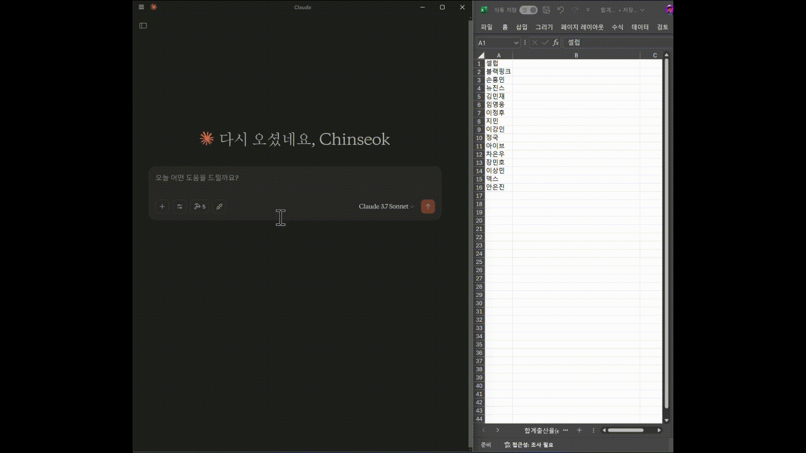

# pyhub-mcptools

## 설치 방법

[공식 문서](https://mcp.pyhub.kr)를 참고해주세요.

## 지원 도구

### 엑셀 MCP 도구

Claude/Cursor와 함께 엑셀 화면을 같이 보며, 함께 읽고 수정할 수 있습니다.

[다른 엑셀 도구](https://github.com/negokaz/excel-mcp-server)는 엑셀 파일에 대한 읽고 쓰기를 지원합니다.
그래서 엑셀 프로그램이 없어도 수행이 가능하다는 장점이 있지만, 실시간으로 엑셀 프로그램의 변경사항을 감지할 수 없고
파일 단위로만 작업이 가능하다는 제한이 있어서 MCP와 동시에 같은 파일을 편집할 수는 없습니다.

본 [엑셀 도구](https://mcp.pyhub.kr)에서는 엑셀 프로그램과 직접 통신하는 방식을 사용하기 때문에,
사용자와 MCP가 동시에 같은 엑셀 파일을 실시간으로 편집할 수 있고, 아직 디스크에 저장하지 않은 메모리 상의
변경 내용까지도 도구에서 읽어갈 수 있습니다. 이를 통해 더욱 자연스럽고 효율적인 협업이 가능합니다.

## 문의

파이썬사랑방, 이진석 (me@pyhub.kr)