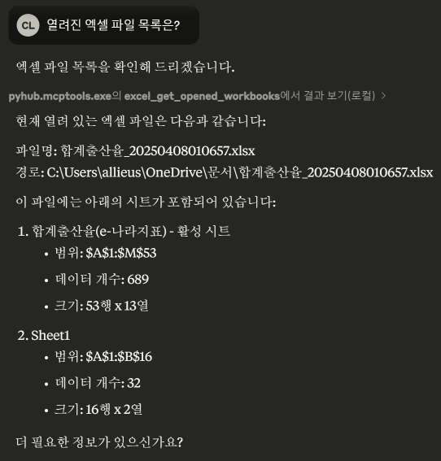

# 엑셀 도구

## 요구 사항

+ 엑셀 2016 이상
+ [윈도우](../../setup/windows/)/[macOS](../../setup/macos/) 지원

## 지원 Tools

### 열린 현황

+ [x] `excel_get_opened_workbooks` : 모든 워크북과 시트 내역 조회

### 시트 데이터 읽고 쓰기

+ [x] `excel_get_values` : 데이터 조회
+ [x] `excel_set_values` : 데이터 기록
+ [x] `excel_set_formula` : 수식 적용
+ [x] `excel_add_sheet` : 새 시트 추가
+ [x] `excel_autofit` : 셀 자동 맞춤

### 차트

+ [x] `excel_get_charts` : 지정 시트 내의 차트 내역 조회
+ [x] `excel_add_chart` : 지정 시트에 새로운 차트 추가
+ [x] `excel_set_chart_props` : 지정 차트의 이름, 데이터, 위치, 타입 변경

## 활용 예

열려진 엑셀 파일 목록도 잘 조회하구요.

지정 시트의 모든 값도 읽을 수 있고, 범위를 지정해서 읽을 수 있습니다.

그리고, 원하는 좌표에 값을 기입할 수도 있습니다.

