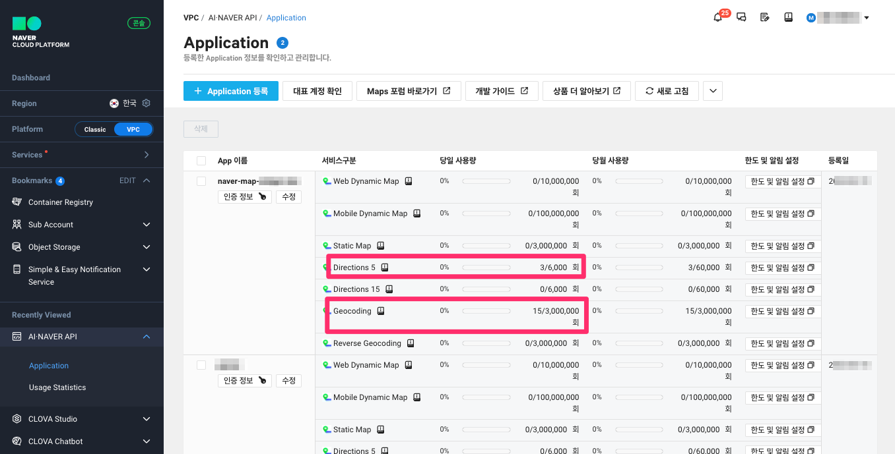

# 지도 도구

`NAVER_MAP_CLIENT_ID` 환경변수와 `NAVER_MAP_CLIENT_SECRET` 환경변수가 지정되면 네이버 길찾기 도구가 활성화됩니다.

[공식문서](https://www.ncloud.com/product/applicationService/maps?region=KR#pricing)에 따르면
무료 범위가 꽤 크기에 개인이 쓰실 때에는 과금없이 편리하게 사용하실 수 있습니다.

+ 지오코딩 API : 300만 요청까지 무료 (초과 건당 0.5원)
+ Directions 5 API : 6만건 요청까지 무료 (초과 건당 5원) 

## API 키 얻기

[https://console.ncloud.com/naver-service/application](https://console.ncloud.com/naver-service/application) 페이지에서
회원가입 후에 "AI NAVER API" 페이지에서 Application 생성 후에 API 키를 발급받으실 수 있습니다.

## 네이버 지오코딩 도구

[Geocoding API](https://guide.ncloud-docs.com/docs/ko/maps-geocoding-api)를 활용하여 주소를 좌표로 변환하며,
길찾기 도구에서 활용됩니다.

지원 인자

+ 검색할 주소 (필수)
+ 중심 좌표 (옵션)
+ 응답 언어 : 한국어 (디폴트), 영어

!!! note

    네이버 지오코딩 API에서는 지명 검색은 지원하지 않구요. "대전 중앙로 215"처럼 주소로 검색을 요청해야 위/경도를 응답합니다.

    

## 네이버 길찾기 도구

네이버 클라우드 플랫폼의 [Directions 5 API](https://api.ncloud-docs.com/docs/ai-naver-mapsdirections-driving)를 활용하며,
경유지를 5개까지 입력할 수 있습니다.

지원 인자

+ 출발 위치 (필수)
+ 도착 위치 (필수)
+ 경유지 (옵션) : 최대 5개
+ 경로 조회 방법 : 실시간 빠른 길 (디폴트), 실시간 편한 길, 실시간 최적, 무료 우선, 자동차 전용 도로 회피 우선
+ 차량 타입 : 1종 (디폴트), 2종, 3종, 4종, 5종, 1종 경차 => 톨게이트 요금 계산에 활용
+ 연료 타입 : 휘발유 (디폴트), 고급 휘발유, 경유, LPG => 유류비 계산에 활용
+ 연비 : 14 (디폴트) => 유료비 계산에 활용
+ 응답 언어 : 한국어 (디폴트), 영어, 일본어, 중국어 간체

=== "스샷 #1"

    

=== "스샷 #2"

    
