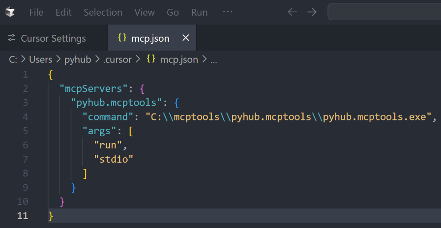
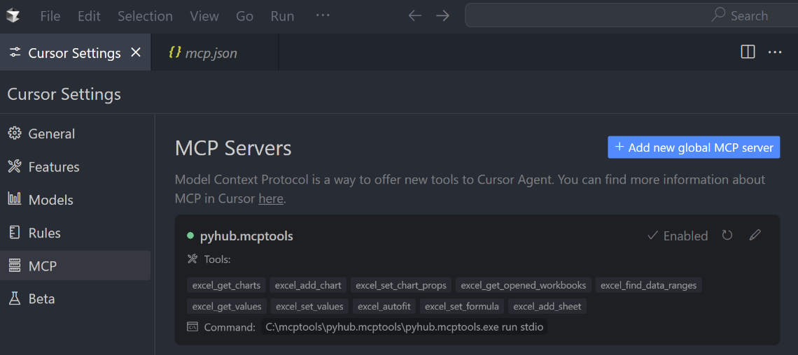
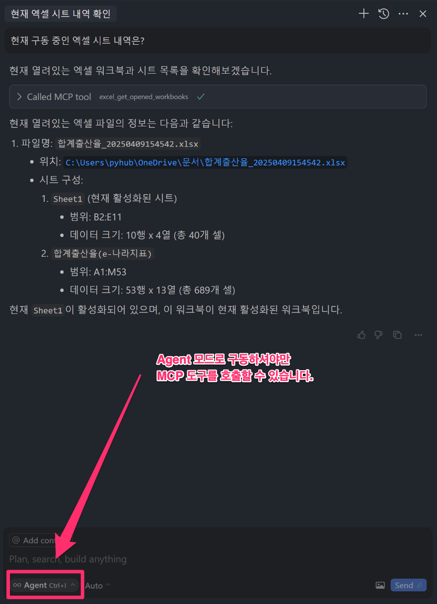

# Cursor

!!! note

    윈도우/macOS 모두에서 Claude Desktop과 Cursor의 MCP 설정 포맷은 동일합니다. 

## 진행하기에 앞서

아래 문서를 참고해서 `pyhub.mcptools` 유틸리티를 설치해주세요.

Claude Desktop은 설치하지 않으셔도 됩니다.

+ [윈도우 (Claude Desktop)](../windows/index.md)
+ [macOS (Claude Desktop)](../macos/index.md)

## STDIO 방식으로 구동하기

Claude Desktop 구동에서는 아래 설정으로 STDIO 방식으로 MCP 서버를 구동했었습니다.
아래 설정파일 포맷은 **Cursor에서도 동일**합니다.

=== "윈도우"

    ``` json
    {
        "mcpServers": {
            "pyhub.mcptools": {
                "command": "C:\\mcptools\\pyhub.mcptools\\pyhub.mcptools.exe",
                "args": [
                    "run",
                    "stdio"
                ]
            }
        }
    }
    ```

=== "macOS"

    ``` json
    {
        "mcpServers": {
            "pyhub.mcptools": {
                "command": "/Users/사용자/mcptools/pyhub.mcptools/pyhub.mcptools",
                "args": [
                    "run",
                    "stdio"
                ]
            }
        }
    }
    ```

Claude Desktop 설정 파일을 Cursor 설정 파일로 직접 복사해서 적용하셔도 되구요.

`setup-add` 명령을 활용하시면 편리합니다. `setup-add` 명령은 다음 2개 툴을 지원합니다.

+ Claude Desktop
+ Cursor

=== "Cursor에 STDIO 방식으로 도구 설정 추가"

    ```
    pyhub.mcptools setup-add cursor
    ```

=== "Claude Desktop에 STDIO 방식으로 도구 설정 추가"

    ```
    pyhub.mcptools setup-add claude
    ```

그럼 아래와 같이 Cursor MCP 설정 파일에 자동으로 추가되구요.



아래와 같이 동작이 확인되었구요.



**Agent 모드**로 채팅하시면 아래와 같이 MCP 도구가 잘 호출이 됨을 확인하실 수 있습니다.


