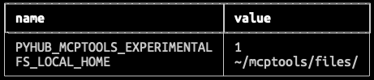
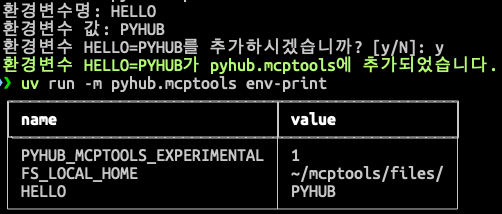
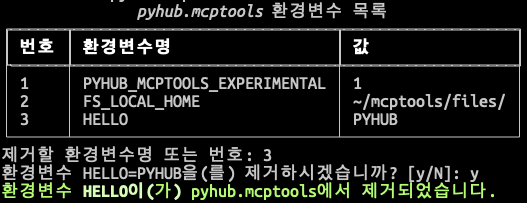

# 환경변수 설정하기

## 환경변수 설정 명령

Claude Desktop 등의 MCP 호스트에서는 JSON 설정에서 `"env"` 키로 환경변수를 설정할 수 있습니다.

``` json title="JSON 문법 오류없이 편집하기 어렵습니다."
{
    "mcpServers": {
        "pyhub.mcptools": {
            "command": "c:\\mcptools\\pyhub.mcptools\\pyhub.mcptools.exe",
            "args": [
                "run",
                "stdio"
            ],
            "env": {
                "PYHUB_MCPTOOLS_EXPERIMENTAL": "1",
                "FS_LOCAL_HOME": "~/mcptools/files/"
            }
        }
    }
}
```

지정 MCP 호스트 (디폴트: `Claude Desktop`), 지정 MCP 서버 (디폴트: `pyhub.mcptools`)에 대한 환경변수 관리를
도와주는 다음 3가지 명령을 지원합니다.

`env-print` : 환경변수 목록을 출력



`env-add` : 환경변수 추가



`env-remove` : 지정 환경변수 제거




## 지원 환경변수

### 지정 이름 패턴의 도구만 노출하기

`ONLY_EXPOSE_TOOLS`

예시

+ 미지정 : 모든 도구가 노출
+ `"excel_.+"` : 모든 엑셀 도구만 노출
+ `"search_perplexity"` : `search_perplexity` 도구만 노출
+ + `"excel_.+,search_perplexity"` : 모든 엑셀 도구와 `search_perplexity` 도구만 노출 (콤마(`,`)로 여러 값을 구별합니다.)

``` json
"env": {
  "ONLY_EXPOSE_TOOLS": "search_.+"
}
```

---

정리 중
