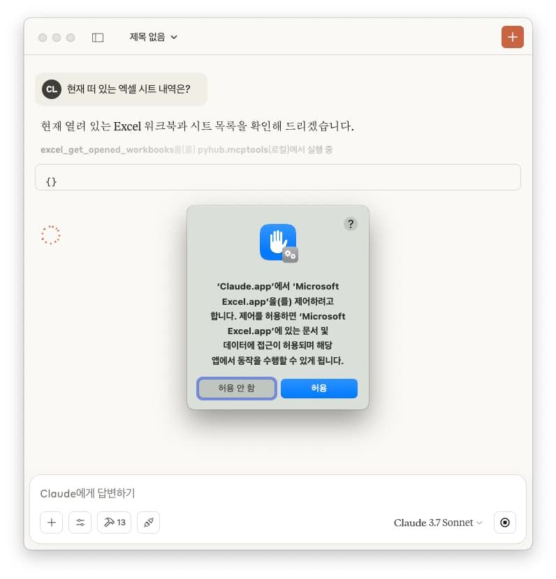
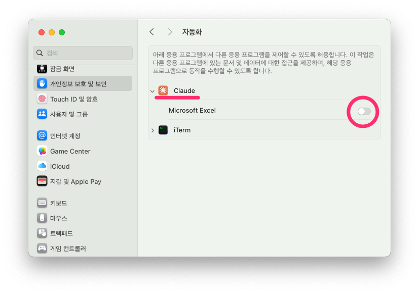

# macOS

## 자동화 권한

macOS에서는 다른 앱을 제어하기 위해서는 자동화 권한을 유저로부터 인가받아야 합니다.

Claude Desktop 앱을 통해 엑셀 도구에 접근할 때 아래와 같이 인가 여부를 물어봅니다. 



"허용 안 함"을 하시면 엑셀 도구를 통해 "Microsoft Excel에 Apple 이벤트를 보낼 권한이 없습니다." 응답을 받으시게 되고,
엑셀 도구를 사용하실 수 없게 됩니다.

만약 "허용 안 함" 버튼을 클릭하셨다면, 다음 순서로 Claude 앱에게 Microsoft Excel 앱에 대한 자동화 권한을 부여하실 수 있습니다. 

1. "시스템 설정" 앱
2. "개인정보 보호 및 보안 (Privacy & Security)" 메뉴
3. "자동화 (Automation)" 메뉴

아래와 같이 Claude 앱이 Microsoft Excel에 대해서 권한이 없는 상황일 것입니다.
토글 버튼을 클릭하여 다시 권한을 부여해주시면 Claude 앱을 통해 엑셀 도구를 사용하실 수 있게 됩니다.



만약 권한을 부여했음에도 Claude를 통해 엑셀 도구에 접근할 수 없다면, 재부팅 혹은 아래 명령으로 Claude 프로세스를 모두 죽인 후에
다시 실행해서 엑셀 도구를 실행해보세요.

``` title="모든 Claude 프로세스 죽이기"
./pyhub.mcptools kill claude
```

혹은 macOS 터미널에서 아래 명령으로 모든 자동화 권한을 초기화하신 후에, 다시 권한을 부여해보세요.

``` title="자동화 권한 초기화 명령"
tccutil reset AppleEvents
```
