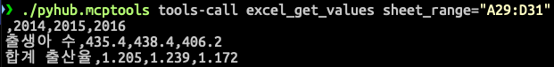

# macOS

## 시작하기에 앞서

윈도우와 macOS를 지원합니다.
설치 스크립트를 제외하고는 설치/설정 방법이 동일합니다.

엑셀 도구 사용을 위해서는 엑셀 2016 이상이 반드시 설치되어 있으셔야 합니다.

## 실행 파일로 빠르게 설치하기

> node/파이썬/도커 설치없이도 실행파일 만으로 MCP 서버를 구성하실 수 있습니다.

### 1. 실행파일 받아서 압축 풀기

다음 과정을 한 번에 수행하실 수 있는 인스톨러 [bash 스크립트](https://raw.githubusercontent.com/pyhub-kr/pyhub-mcptools/refs/heads/main/scripts/install.sh)를 제공합니다.

1. 최신 버전 다운로드 및 다운로드 파일에 대한 SHA256 체크섬 무결성 검증
2. `~\mcptools\` 경로에 자동 압축 해제 : 경로 변경 가능

터미널을 열고, 다음 명령을 복사해서 실행해주세요.

``` title="터미널"
bash <(curl -fsSL https://raw.githubusercontent.com/pyhub-kr/pyhub-mcptools/refs/heads/main/scripts/install.sh)
```


디폴트 경로인 `~/mcptools/pyhub.mcptools/` 디렉토리에 설치가 되었습니다. 아래 명령으로 디렉토리 이동해주세요.

```
cd ~/mcptools/pyhub.mcptools/
```

아래와 같이 `pyhub.mcptools` 파일과 `_internal` 폴더가 확인되시면 설치 성공입니다.


!!! note

    `~`는 macOS/Linux 쉘에서 홈 디렉토리 경로를 의미하며, `/Users/현재유저명/` 경로가 됩니다.

### 2. 툴 사용해보기 

툴 버전과 help 도움말도 출력해보세요.

```
./pyhub.mcptools --help
./pyhub.mcptools --version
```

!!! note

    `./pyhub.mcptools` 명령에서 `./` 은 현재 폴더 경로를 의미합니다.
    즉 `./pyhub.mcptools`는 현재 폴더 경로의 `pyhub.mcptools` 파일을 의미합니다.


"파이썬사랑방 MCP 도구"에서 지원하는 도구 목록을 확인하실 수 있습니다.

```
./pyhub.mcptools tools-list -v 1
```


`-v` 인자를 `2`로 지정하시면 각 Tool에 대한 세부 설명을 보실 수 있고, `3`으로 지정하시면 각 Tool 인자에 대한 세부 내역을 보실 수 있습니다.
각 Tool에 대한 세부 설명과 인자에 대한 세부 설명은 Claude에서 읽어가서 필요한 Tool 선정에 참고하게 됩니다.

```
./pyhub.mcptools tools-list -v 2
```


### 3. MCP 도구를 통해 엑셀 읽어보기

Claude에서 알아서 필요한 MCP 도구를 호출할테지만, 지원하는 엑셀 도구와의 인터페이스를 이해하기 위해 MCP 도구를 직접 실행해봅시다.
"파이썬 사랑방 MCP 도구"에서는 MCP 도구 직접 실행을 지원합니다. 간편하게 MCP 도구 동작을 확인하실 수 있습니다. 😉
다른 MCP 도구들은 [MCP Inspector](https://modelcontextprotocol.io/docs/tools/inspector)를 통해서만 동작을 확인하게 됩니다.

먼저 통계청 [합계출산율](https://www.index.go.kr/unity/potal/main/EachDtlPageDetail.do?idx_cd=1428) 엑셀 파일을 받아서 열어주세요.

`pyhub.mcptools`에서는 `tools-call` 명령으로 지정 도구를 호출할 수 있습니다.
`excel_get_opened_workbooks` 도구를 호출하여 현재 엑셀 프로그램을 통해 열려있는 엑셀 파일 내역을 조회해보겠습니다.

```
./pyhub.mcptools tools-call excel_get_opened_workbooks
```


그리고, 아래 명령으로 현재 활성화된 (앞에 띄워진) 시트의 모든 데이터를 조회할 수 있으며,

```
./pyhub.mcptools tools-call excel_get_values
```

`sheet_range="A29:D31"` 인자를 지정하여 지정 범위의 값 만을 읽어올 수도 있습니다.

```
./pyhub.mcptools tools-call excel_get_values sheet_range="A29:D31"
```



그리고, `excel_set_values` 도구를 통해 지정 범위의 값들을 변경하실 수도 있습니다.

```
./pyhub.mcptools tools-call excel_set_values sheet_range="A34" json_values="[['val1', 'val2', 'val3'], ['val4', 'val5', 'val6']]"
```

물론 다른 특정 시트를 지정해서 값을 읽어오거나 값을 변경하는 도구도 지원합니다.

!!! note

    우리는 방금 일일이 Tool 이름과 인자를 지정해서 호출했지만, 이제 그럴 필요가 없습니다.
    
    상상해보세요. Claude/Cursor에게 말만 하면, 알아서 지정한 위치의 데이터를 읽어가고 AI가 생각한 뒤에 지정한 위치에 데이터를 기록합니다. 😮

### 4. Claude Desktop에 등록하기

이제 Claude Desktop에 등록해서, AI가 알아서 엑셀 도구 호출을 요청해서 데이터를 읽어가고 값을 변경할 수 있도록 해보겠습니다.
[Claude Desktop](https://claude.ai/download) 프로그램이 아직 설치되어 있지 않으시다면 다운받아서 설치하시고 로그인해주세요.

!!! note

    Claude 무료 계정에서도 MCP를 사용하실 수 있습니다. 단, 유료 계정에 비해서 제한적으로 적은 횟수의 채팅만 지원됩니다.

!!! note

    MCP 도구는 웹 브라우저가 아닌 로컬에 설치된 Claude Desktop을 통해서만 사용하실 수 있습니다.
    다른 MCP 클라이언트 프로그램은 [Example Clients](https://modelcontextprotocol.io/clients) 페이지에서 확인하실 수 있습니다.
    (ex: Claude Code, Copilot-MCP, Cursor, Cline, Continue)

    "파이썬사랑방 MCP 도구" 에서는 Claude Desktop에 대한 자동 설정을 지원합니다.
    다른 MCP 클라이언트 프로그램에 대한 자동 설정은 지원하진 않지만, 직접 설정하셔서 사용하실 수 있습니다.

Claude Desktop 프로그램을 실행하시고, "파일" -> "설정" 창을 띄워주세요.


개발자 탭에서 MCP 서버 설정 내역을 확인하실 수 있습니다. 지금은 등록된 MCP 서버가 없어서 목록이 비워진 상황입니다.
"설정 편집" 버튼을 클릭하시면
Finder를 통해 `/Users/사용자/Library/Application Support/Claude/claude_desktop_config.json` 경로의 파일을 확인하실 수 있습니다.


이 파일을 텍스트 편집기를 통해 여셔서 아래 내용으로 직접 설정을 수정해주셔야 하는 데요.
이 부분에서 실수할 여지가 많습니다. (경로명 오타, JSON 문법 오류, 관련 프로그램 미설치 등)

```json
{
    "mcpServers": {
        "pyhub.mcptools": {
            "command": "/Users/allieus/mcptools/pyhub.mcptools/pyhub.mcptools",
            "args": [
                "run",
                "stdio"
            ]
        }
    }
}
```

`pyhub.mcptools` 하나에 관련 라이브러리가 모두 포함되어있으니, 관련 프로그램은 모두 설치된 상황이구요.
MCP 설정을 자동으로 추가해주는 명령을 지원합니다.
JSON 파일 편집없이 한 번에 설정을 추가하실 수 있기 때문에 "경로명 오타", "JSON 문법 오류" 등이 발생할 여지가 전혀 없습니다. 😉

일단 `./pyhub.mcptools setup-print` 명령으로 현재 설정 내역을 출력해보시죠. 아래와 같이 파일이 없다고 출력되거나 `{}` 처럼 빈 설정으로 출력이 되실 거구요.


이제 `./pyhub.mcptools setup-add` 명령만 실행하시면 한 번에 `pyhub.mcptools` 에 대한 MCP 서버 설정이 자동으로 추가되고, 
다시 `./pyhub.mcptools setup-print` 명령을 실행해보시면 아래와 같이 설정이 적용되었음을 확인하실 수 있습니다. 


### 5. Claude Desktop 재실행

이제 Claude Desktop 프로그램을 완전히 종료해주시고 재실행해주시면, Claude Desktop에서 MCP 설정을 다시 로딩하고 Claude Desktop 내부에서 MCP 서버를 새롭게 띄웁니다.

macOS에서는 종료 시에 단순히 "닫기" 버튼을 클릭하시면 완전히 종료되지 않습니다. Claude Desktop을 선택하신 후에 Command-Q 단축키를 누르셔야 완전히 종료됩니다.

혹은 아래 `kill` 명령을 실행하시면 한 번에 Claude Desktop 애플리케이션을 종료시키실 수 있습니다.

```
./pyhub.mcptools kill claude
```


이제 다시 Claude Desktop 애플리케이션을 열어주세요.

!!! note

    제어 허용 여부를 묻는 창이 뜨면 반드시 "허용"을 해주세요.

등록된 MCP 도구 실행에 시간이 몇 초 정도 걸릴 것이구요. 아래와 같이 등록된 MCP 도구 개수를 확인하실 수 있습니다.


위 스크린샷에서는 도구가 9개이구요. 정상적으로 도구를 인식했습니다. 향후 업데이트가 되면 지원하는 도구 개수가 늘어날 수 있습니다.

망치 아이콘을 클릭하시면 이렇게 "파이썬사랑방 MCP 도구"에서 지원하는 도구 목록을 확인하실 수 있습니다.


이제 Claude를 대화를 하면, Claude가 엑셀 도구가 필요하다고 판단하는 시점에 알아서 엑셀 도구를 호출합니다.

### 6. 자동화 권한

macOS에서는 다른 앱을 제어하기 위해서는 자동화 권한을 유저로부터 인가받아야 합니다.
Claude Desktop 앱을 통해 엑셀 도구에 접근할 때 아래와 같이 인가 여부를 물어봅니다.
반드시 "허용" 버튼을 클릭해주세요.


"허용 안 함"을 하시면 엑셀 도구를 통해 "Microsoft Excel에 Apple 이벤트를 보낼 권한이 없습니다." 응답을 받으시게 되고,
엑셀 도구를 사용하실 수 없게 됩니다.
만약 "허용 안 함" 버튼을 클릭하셨다면, 다음 순서로 Claude 앱에게 Microsoft Excel 앱에 대한 자동화 권한을 부여하실 수 있습니다. 

1. "시스템 설정" 앱
2. "개인정보 보호 및 보안 (Privacy & Security)" 메뉴
3. "자동화 (Automation)" 메뉴

아래와 같이 Claude 앱이 Microsoft Excel에 대해서 권한이 없는 상황일 것입니다.
토글 버튼을 클릭하여 다시 권한을 부여해주시면 Claude 앱을 통해 엑셀 도구를 사용하실 수 있게 됩니다.


만약 권한을 부여했음에도 Claude를 통해 엑셀 도구에 접근할 수 없다면, 재부팅 혹은 아래 명령으로 Claude 프로세스를 모두 죽인 후에
다시 실행해서 엑셀 도구를 실행해보세요.

``` title="모든 Claude 프로세스 죽이기"
./pyhub.mcptools kill claude
```

혹은 macOS 터미널에서 아래 명령으로 모든 자동화 권한을 초기화하신 후에, 다시 권한을 부여해보세요.

``` title="자동화 권한 초기화 명령"
tccutil reset AppleEvents
```

### 7. Claude와 엑셀 협업하기

[엑셀 도구](../../mcptools/excel/) 페이지를 참고해주세요.

### 8. 최신 버전으로 업데이트하기

`./pyhub.mcptools --version` 명령을 통해 현재 버전을 확인하실 수 있고,
`./pyhub.mcptools check-update` 명령을 통해 새버전 유무를 확인하실 수 있으며,
`./pyhub.mcptools update` 명령을 통해 새 버전으로 업데이트하실 수 있습니다.

```
./pyhub.mcptools update
```


Claude Desktop을 다시 실행해주시면 업데이트 끝입니다.
