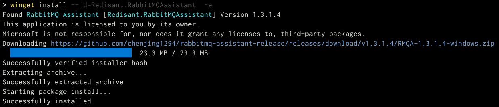
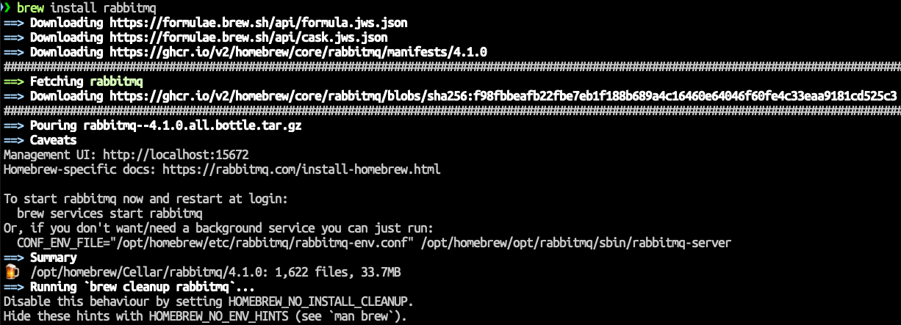

# RabbitMQ

## 설치 명령

=== "윈도우"

    https://winstall.app/apps/Redisant.RabbitMQAssistant

    ```
    $ winget install --id=Redisant.RabbitMQAssistant  -e
    ```

    

=== "macOS"

    ```
    $ brew install rabbitmq
    ```

    

    ```
    $ brew services start rabbitmq
    ==> Successfully started `rabbitmq` (label: homebrew.mxcl.rabbitmq)
    ```

    macOS를 리부팅해도 자동 재시작됩니다.

    ```
    $ brew services info rabbitmq
    rabbitmq (homebrew.mxcl.rabbitmq)
    Running: ✔
    Loaded: ✔
    Schedulable: ✘
    User: allieus
    PID: 23174
    ```

## 설정

### 윈도우

### macOS

Q: 이에 대한 공식문서는 ??

+ 설정 파일: `/opt/homebrew/etc/rabbitmq/rabbitmq.conf` (자동 생성 X)
+ 환경 변수 파일: `/opt/homebrew/etc/rabbitmq/rabbitmq-env.conf`

#### 환경변수

``` title="/opt/homebrew/etc/rabbitmq/rabbitmq-env.conf"
CONFIG_FILE=/opt/homebrew/etc/rabbitmq/rabbitmq
NODE_IP_ADDRESS=127.0.0.1
NODENAME=rabbit@localhost
RABBITMQ_LOG_BASE=/opt/homebrew/var/log/rabbitmq
PLUGINS_DIR="/opt/homebrew/opt/rabbitmq/plugins:/opt/homebrew/share/rabbitmq/plugins"
```

+ `CONFIG_FILE` : RabbitMQ 설정파일 경로
+ `NODE_IP_ADDRESS` : `127.0.0.1` 이기에 로컬 호스트에서만 접근 가능.
+ `NODENAME` : Erlang 노드 이름.
+ `RABBITMQ_LOG_BASE` : 로그 파일이 저장될 디렉토리 경로
+ `PLUGINS_DIR` : RabbitMQ에서 플러그인을 검색할 디렉토리

추가

+ `RABBITMQ_NODE_PORT` : 디폴트 5672
+ `RABBITMQ_CONF_ENV_FILE` : 환경변수 파일 경로
+ `RABBITMQ_DEFAULT_USER` : 기본 사용자명 (디폴트: guest)
+ `RABBITMQ_DEFAULT_PASS` : 기본 암호 (디폴트: guest)

#### 플러그인

아래 플러그인이 디폴트 활성화되어있습니다.

``` title="/opt/homebrew/etc/rabbitmq/enabled_plugins"
[rabbitmq_management,rabbitmq_stomp,rabbitmq_amqp1_0,rabbitmq_mqtt,rabbitmq_stream].%
```

+ `rabbitmq_management` : 웹 기반 관리 인터페이스 제공
+ `rabbitmq_stomp` : STOMP 프로토콜 지원
+ `rabbitmq_amqp1_0` : AMQP 1.0 프로토콜 지원
+ `rabbitmq_mqtt` : MQTT 프로토콜 지원
+ `rabbitmq_stream` : 스트림 메시징 지원

!!! note

    플러그인 변경 후에는 RabbitMQ 서비스를 재시작해야 변경사항이 적용됩니다.
