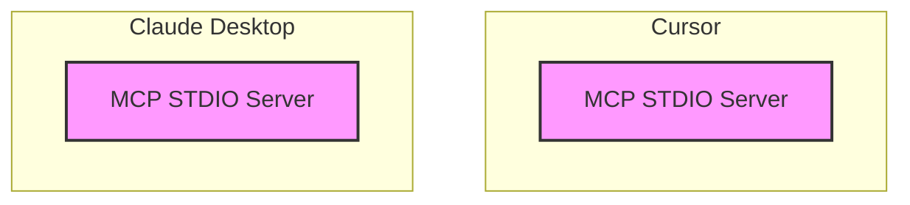
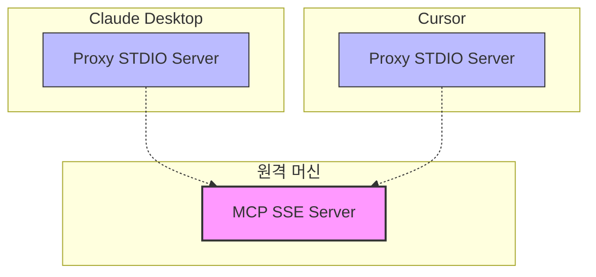
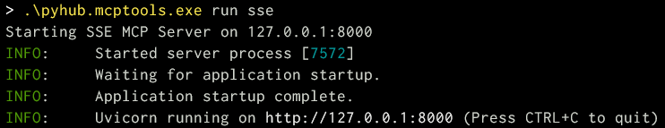
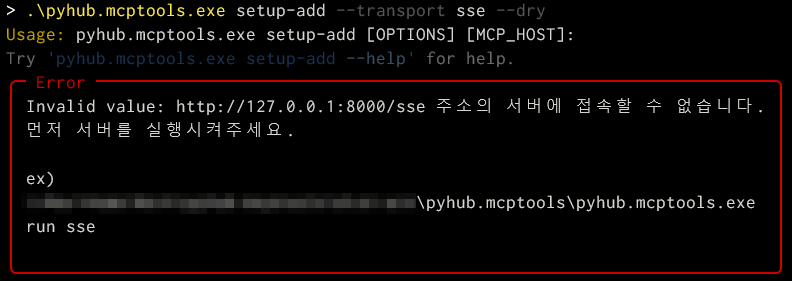
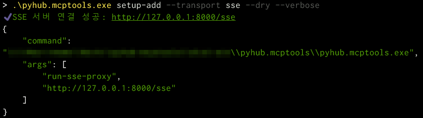
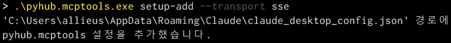
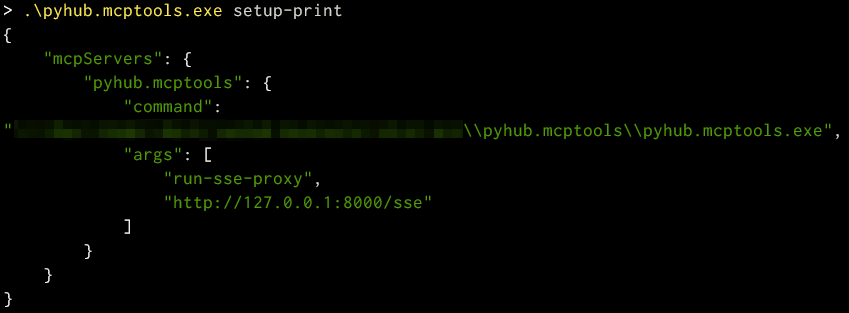
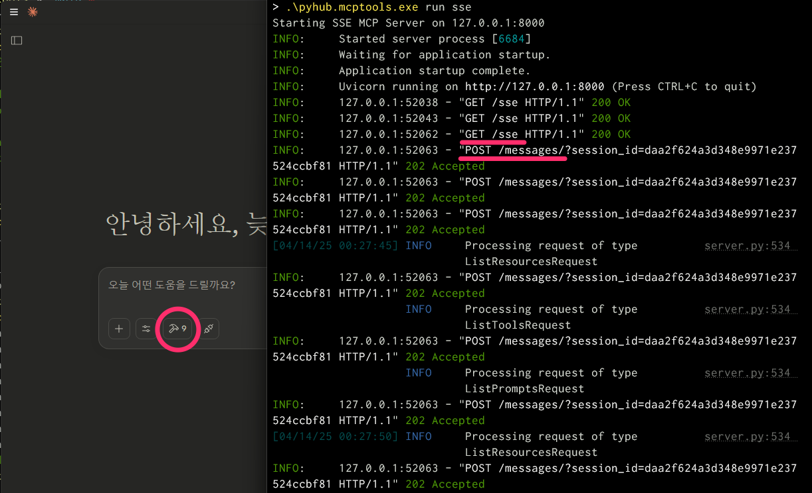

# SSE 방식으로 MCP 서버 구축

MCP 서버는 다음 두 가지 방식으로 구동할 수 있습니다:

## 작동 방식 비교

### 1. STDIO 방식 (디폴트)

+ Claude Desktop 등의 MCP 호스트 프로그램이 직접 MCP 서버를 내부적으로 구동
+ 각 MCP 호스트 프로그램마다 별도의 MCP 서버가 구동
+ 프로세스 간 직접 통신으로 가장 빠르고 안정적



### 2. SSE(Server-Sent Events) 방식

+ 독립적인 웹서버로 구동되어 여러 MCP 호스트 프로그램이 공유
+ HTTP 기반 통신으로 네트워크를 통한 원격 접속 가능
+ 팀 단위에서 하나의 MCP 서버를 공유 가능

!!! note

    Claude Desktop에서는 공식적으로 STDIO 방식만 지원하기에,
    STDIO 방식의 프록시 서버를 경유해서 SSE 서버에 접속해야만 합니다.



## 구축 방법

### SSE 방식으로 MCP 서버 실행

먼저 "파이썬 사랑방 MCP 도구"를 별도의 서버로서 구동해주셔야 합니다.
`--host` (디폴트: `127.0.0.1`) 옵션으로 listen 주소를,
`--port` (디폴트: `8000`) 옵션으로 listen 포트번호를 변경하실 수 있습니다.

```
pyhub.mcptools run sse
```



!!! note

    SSE 서버를 구동하신 터미널은 계속 띄워두고 계셔야 합니다. 터미널을 끄시면 서버도 종료됩니다.
    SSE 서버를 GUI를 통해 구동/관리하는 기능은 준비 중입니다.

### run-sse-proxy 명령

"파이썬 사랑방 MCP 도구"는 `run-sse-proxy` 명령을 통해 지정 SSE 서버와의 프록시를 지원합니다.
아래 명령을 수행하면, `http://127.0.0.1:8000/sse` 주소의 MCP 도구를 STDIO 방식으로 사용하실 수 있습니다.

```
pyhub.mcptools run-sse-proxy http://127.0.0.1:8000/sse
```

### Claude Desktop에 MCP 서버 등록

`setup-add` 명령에서 `--transport sse` 옵션을 지정하시면 `run-sse-proxy` 명령을 사용하는 MCP 설정을 추가합니다.
설정을 추가하기 전에 `--dry` 옵션을 붙여 먼저 설정을 확인해봅시다.

```
pyhub.mcptools setup-add --transport sse --dry --verbose
```

!!! note

    디폴트로 `http://127.0.0.1:8000/sse` 주소를 사용합니다.
    접속 주소를 변경하실려면 인자로 주소를 지정해주세요.


SSE 접속 주소에서 오타가 있거나, SSE 서버 구동을 깜빡하실 수 있는 데요.
이 상황을 디버깅하기가 까다롭습니다.
그래서 지정한 주소의 서버에서 MCP 응답을 하는 지를 확인하는 기능을 추가했습니다.
자동으로 지정 주소의 MCP SSE 서버 응답을 확인해주어 편리합니다. 

`http://127.0.0.1:8000/sse` 주소의 서버에 접속할 수 없거나, MCP SSE 서버 응답이 아닐 경우에는 아래와 같이 에러가 발생하구요.



`http://127.0.0.1:8000/sse` 주소에서 서버가 구동 중일 경우에는 아래와 같이 설정이 출력됩니다.



이제 다음 명령으로 Claude Desktop MCP 설정에 SSE 서버에 대한 설정을 추가해주시구요. 

```
pyhub.mcptools setup-add --transport sse
```



MCP 설정을 확인해보시면 아래와 같이 설정이 잘 적용되어있음을 확인하실 수 있습니다.

```
pyhub.mcptools setup-print
```



Claude Desktop 프로세스를 모두 죽여주시구요.

```
pyhub.mcptools kill claude
```

Claude Desktop을 다시 실행해보시면 아래와 같이 도구들이 잘 로딩되고,
SSE 서버 로그를 통해서도 이렇게 통신이 잘 이뤄짐을 확인하실 수 있습니다. 


