# 윈도우 (Claude Desktop)

## 시작하기에 앞서

엑셀 도구 사용을 위해서는 엑셀 2016 이상이 반드시 설치되어 있으셔야 합니다.

## 실행 파일로 빠르게 설치하기

> node/파이썬/도커 설치없이도 실행파일 만으로 MCP 서버를 구성하실 수 있습니다.

### 1. 실행파일 받아서 압축 풀기

#### 방법 1) 명령 한 방 버전 (추천)

다음 과정을 한 번에 수행하실 수 있는 [인스톨러 파워쉘 스크립트](https://github.com/pyhub-kr/pyhub-mcptools/blob/main/scripts/install.ps1)를
제공합니다.

1. 최신 버전 다운로드 및 다운로드 파일에 대한 SHA256 체크섬 무결성 검증
2. `c:\mcptools\` 경로에 자동 압축 해제 : 경로 변경 가능

파워쉘을 여시고, 다음 명령을 복사해서 실행해주세요.

=== "윈도우 기본 파워쉘"

    ``` ps1
    powershell -ExecutionPolicy Bypass -NoProfile -Command "iex (iwr -UseBasicParsing 'https://raw.githubusercontent.com/pyhub-kr/pyhub-mcptools/refs/heads/main/scripts/install.ps1')"
    ```

    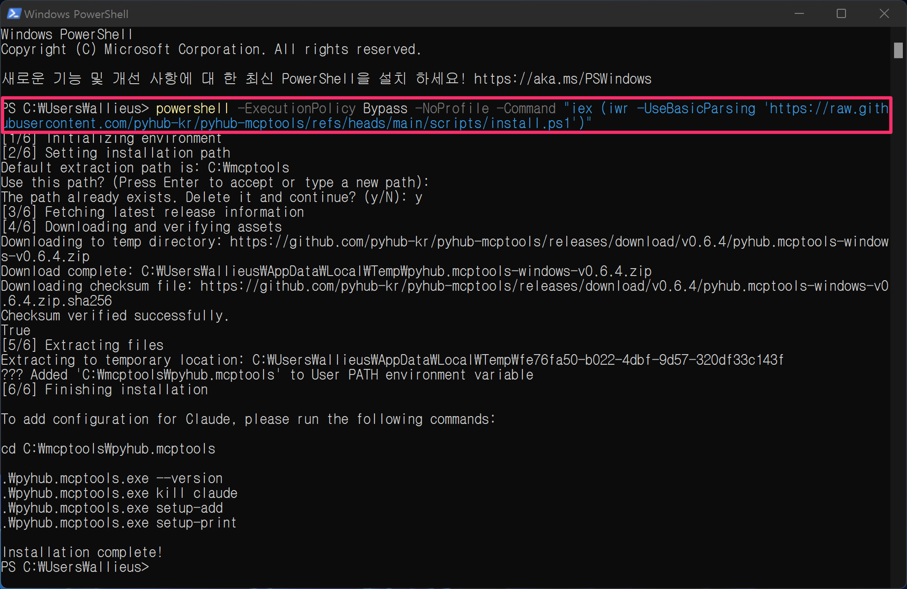

=== "파워쉘 코어 7"

    ``` ps1
    pwsh -NoProfile -Command "iex (iwr 'https://raw.githubusercontent.com/pyhub-kr/pyhub-mcptools/refs/heads/main/scripts/install.ps1')"
    ```

    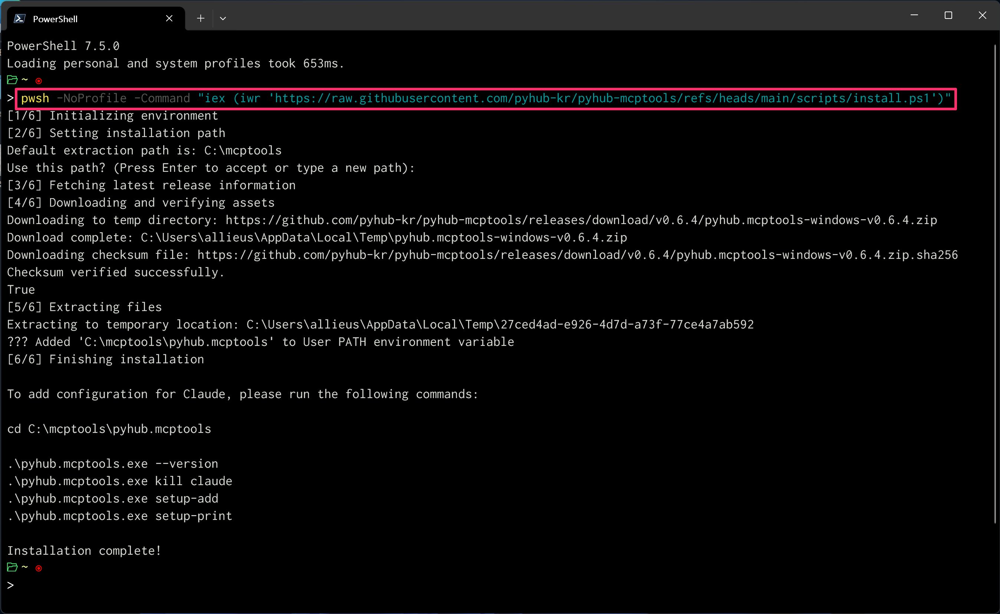

!!! info "알파/특정 버전 설치"

    **최신 알파 버전 설치:**
    ```powershell
    # 파워쉘 코어 7
    & { iwr 'https://raw.githubusercontent.com/pyhub-kr/pyhub-mcptools/refs/heads/main/scripts/install.ps1' | iex } -Alpha

    # 윈도우 기본 파워쉘
    & { iwr -UseBasicParsing 'https://raw.githubusercontent.com/pyhub-kr/pyhub-mcptools/refs/heads/main/scripts/install.ps1' | iex } -Alpha
    ```

    **특정 버전 설치:**
    ```powershell
    # 파워쉘 코어 7
    & { iwr 'https://raw.githubusercontent.com/pyhub-kr/pyhub-mcptools/refs/heads/main/scripts/install.ps1' | iex } -Version "v0.9.6"

    # 윈도우 기본 파워쉘
    & { iwr -UseBasicParsing 'https://raw.githubusercontent.com/pyhub-kr/pyhub-mcptools/refs/heads/main/scripts/install.ps1' | iex } -Version "v0.9.6"
    ```

디폴트 경로로 `c:\mcptools\pyhub.mcptools\` 폴더에 아래와 같이 `pyhub.mcptools.exe` 파일과 `_internal` 폴더가 확인되시면
설치 성공입니다. 이어서 다음 단계 "2. 실행파일 차단풀기" 를 진행해주세요.

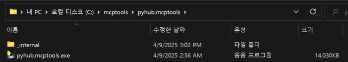

!!! note

    윈도우 기본 파워쉘 (버전 5)보다 최신 버전의 [파워쉘 코어 v7](https://aka.ms/PSWindows)을 추천드립니다.
    UI도 미려해지고 사용성도 좋아요. 👍

    요즘 윈도우에는 기본에 `winget` 팩키지 매니저가 설치되어있습니다. 다음 명령 한 번에 설치됩니다.

    ```
    winget install --id Microsoft.PowerShell --source winget
    ```

!!! warning

    설치 시에 Rate limit exceeded 오류가 발생할 수 있습니다.
    팩키지 최신 버전 조회를 위해
    [GitHub REST API](https://docs.github.com/en/rest/using-the-rest-api/rate-limits-for-the-rest-api)를 사용합니다.
    비인증 API 요청에 대해서는 60회/1시간 제한이 있기 때문입니다.
    1시간 후에 다시 시도하시거나, 아래 "방법 2"로 설치하실 수 있습니다.

#### 방법 2) 직접 받아서 압축 풀기

[공식 릴리즈 페이지](https://github.com/pyhub-kr/pyhub-mcptools/releases)에서 윈도우 용으로 최신 버전을 받아주세요.

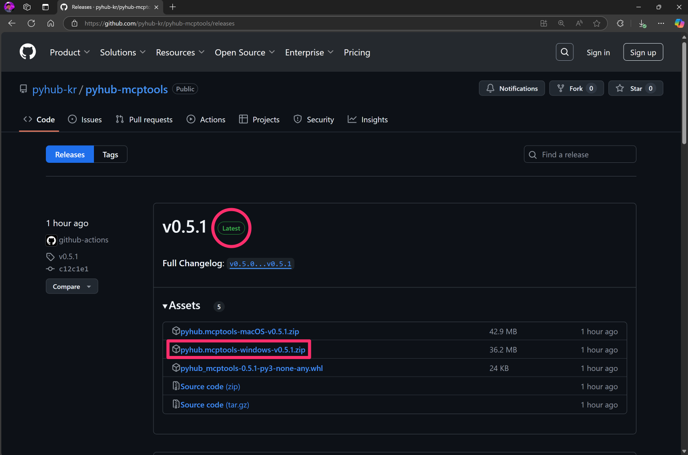

원하는 경로에 압축을 풀어주세요. 저는 `c:\mcptools\` 경로에 풀어주겠습니다. 여러분도 같은 경로에 풀어주세요.

!!! note

    설치 마법사는 지원 예정이며, 실행 파일을 직접 복사해주셔야 합니다.

`c:\mcptools\pyhub.mcptools\` 폴더 아래에서 `pyhub.mcptools.exe` 실행 파일이 확인됩니다.

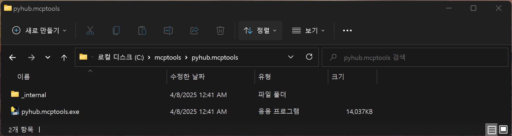

### 2. 실행파일 차단 풀기

윈도우 탐색기에서 `pyhub.mcptools.exe` 파일을 더블클릭해서 실행해주세요.
`pyhub.mcptools.exe` 파일은 아직 서명되지 않아서 아래와 같이 Microsoft Defender SmartScreen에서 실행을 막습니다.

!!! note

    만약 아래의 "Windows의 PC 보호" 창이 뜨지 않고 까만 터미널 창이 떴다가 사라진다면,
    실행파일 차단이 안 된 상황이므로 다음 3단계로 넘어가시면 됩니다.

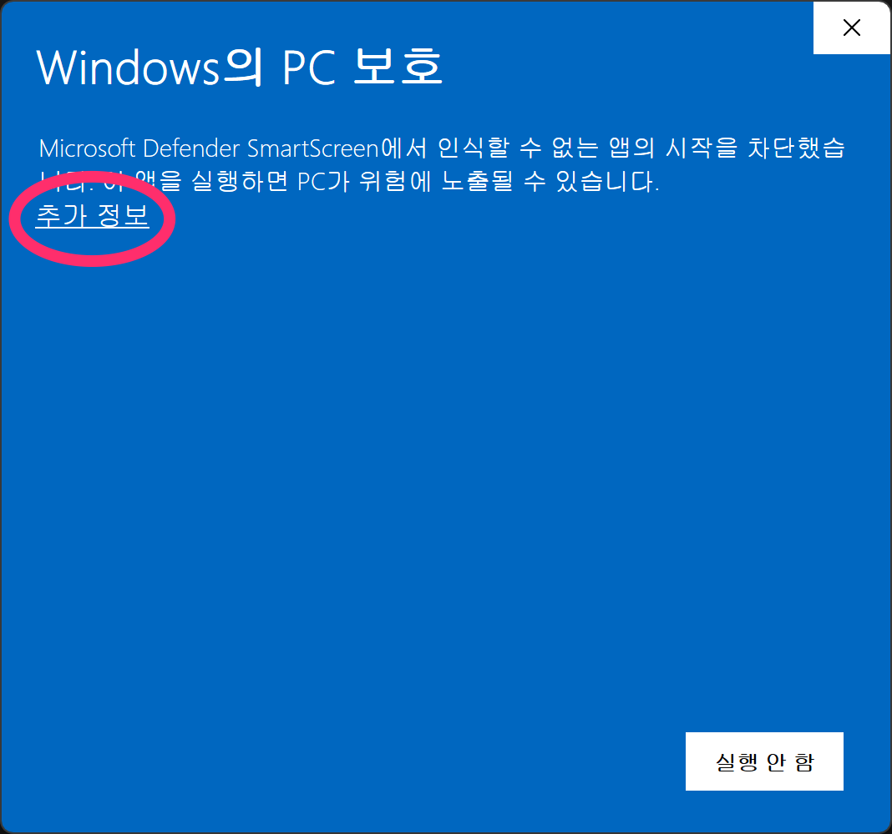

"추가 정보" 링크를 클릭하시면 아래와 같이 경고 화면이 뜹니다. "실행" 버튼을 클릭하시면, 실행 허용이 됩니다.

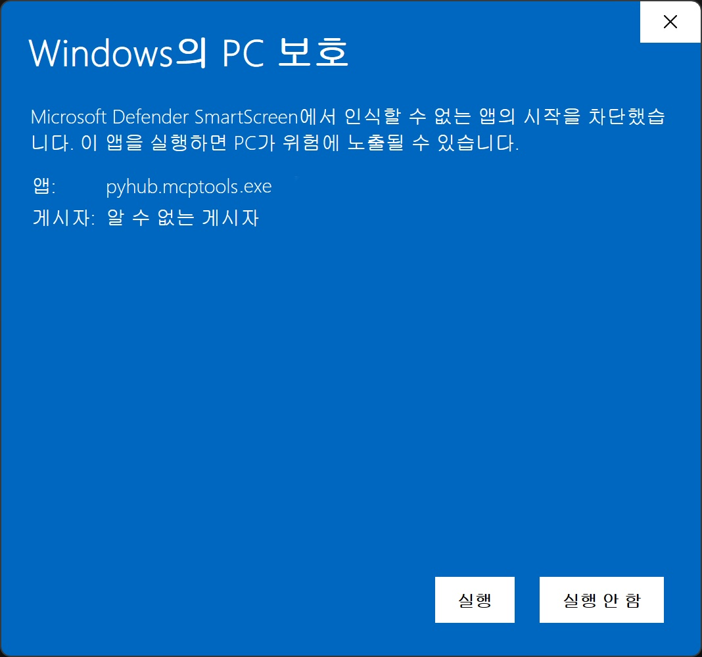

그럼 아래의 까만 창이 실행되었다가 빠르게 사라질 것입니다.

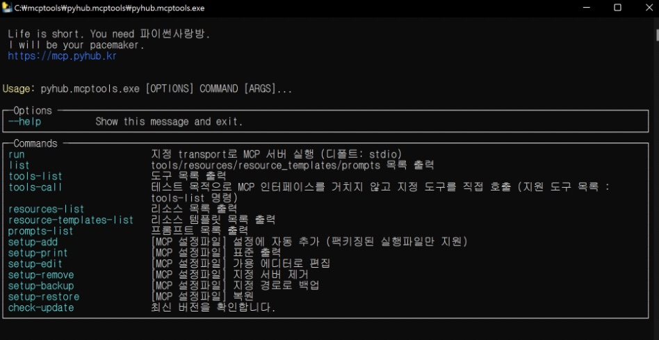

### 3. 엑셀 Tool 실행을 확인하기

아직 GUI는 지원하지 않고, 명령행에서 명령을 실행해주셔야 합니다. 명령 프롬프트를 띄워주세요.

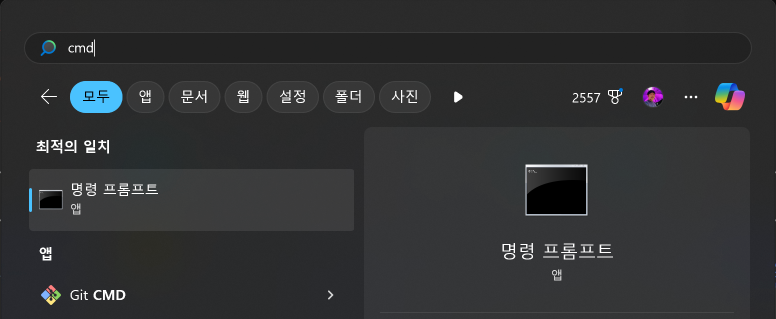

명령 프롬프트에서 다음 명령으로 `c:\` 경로로 이동해주시구요.

```
cd \
```

다음 명령으로 `mcptools\pyhub.mcptools\` 경로로 이동합니다.

```
cd mcptools\pyhub.mcptools\
```

아래 명령으로 지원하는 도구 목록을 확인하실 수 있습니다.

```
.\pyhub.mcptools.exe tools-list
```

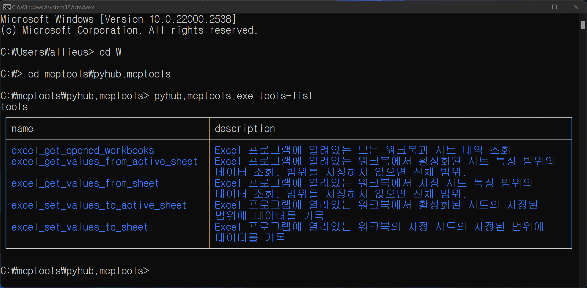

`-v 3` 옵션을 주시면 각 Tools 인자에 대한 상세 내역까지 확인하실 수 있습니다.

```
.\pyhub.mcptools.exe tools-list -v 3
```

Claude와 같은 MCP 클라이언트 프로그램에서는 위 Tools 설명을 기반으로, 어떤 Tool을 호출할 것인지를 결정합니다.

!!! note

    `c:\mcptools\` 경로명에서 역슬래시(`\`) 글자와 원화 글자는 폰트에 따라 다르게 보여질 뿐, 같은 글자입니다.

### 4. MCP 도구를 통해 엑셀 읽어보기

Claude 에서 AI가 알아서 MCP 도구를 호출할 테지만, 지원하는 엑셀 도구와의 인터페이스를 이해하기 위해 MCP 도구를 직접 실행해봅시다.
"파이썬사랑방 MCP 도구"에서는 MCP 도구 직접 실행을 지원합니다. 간편하게 MCP 도구 동작을 확인하실 수 있습니다. 😉 다른 MCP 도구들은
[MCP Inspector](https://modelcontextprotocol.io/docs/tools/inspector)를 써야만 동작을 확인할 수 있습니다.

먼저 통계청 [합계출산율](https://www.index.go.kr/unity/potal/main/EachDtlPageDetail.do?idx_cd=1428) 엑셀 파일을 받아서 열어주세요.

`pyhub.mcptools.exe`에서는 `tools-call` 명령으로 지정 도구를 호출할 수 있습니다.
`excel_get_opened_workbooks` 도구를 호출하여 현재 엑셀 프로그램을 통해 열려있는 엑셀 파일 내역을 조회해보겠습니다.

```
.\pyhub.mcptools.exe tools-call excel_get_opened_workbooks
```

!!! warning

    Norton과 같은 보안 프로그램에서 엑셀 프로그램 호출을 차단하여, 열려진 엑셀 시트 조회가 안 될 수 있습니다.
    Norton 프로그램을 종료 후에 다시 시도해보세요. :-)

그리고, 아래 명령으로 현재 활성화된 (앞에 띄워진) 시트의 모든 데이터를 조회할 수 있습니다.

```
.\pyhub.mcptools.exe tools-call excel_get_values
```

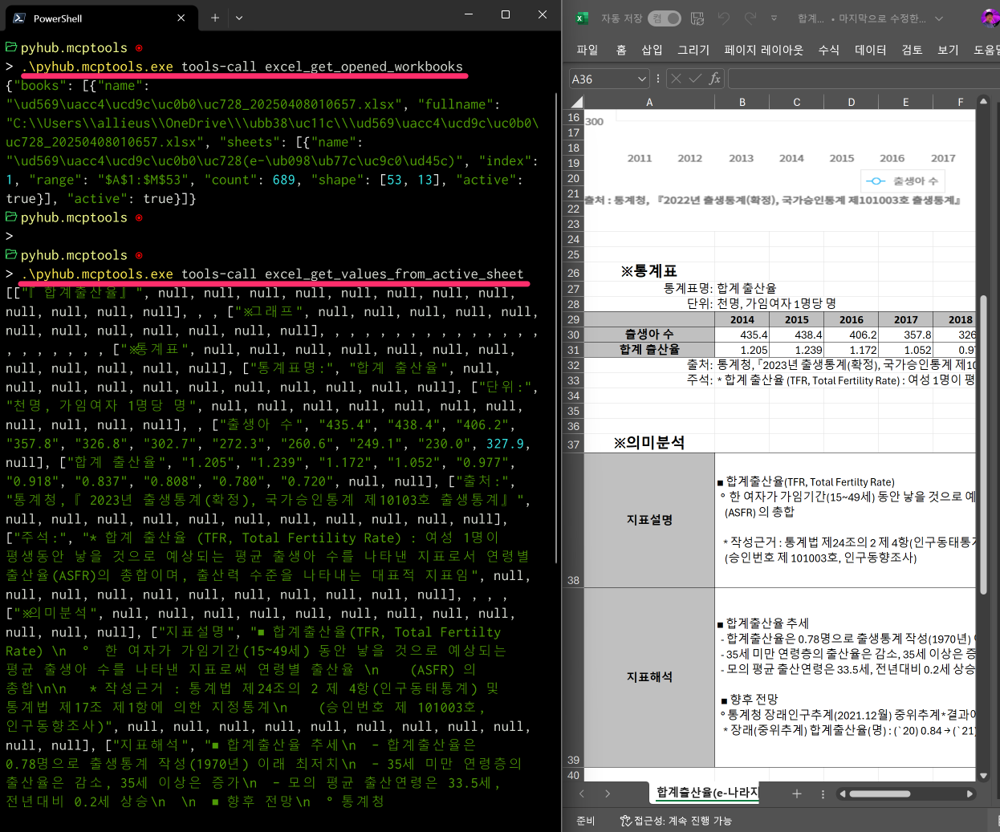

`excel_get_values` 도구 호출 시에 `sheet_range="A29:D31"` 인자를 지정하여
지정 범위의 값 만을 읽어올 수도 있습니다.

```
.\pyhub.mcptools.exe tools-call excel_get_values sheet_range="A29:D31"
```

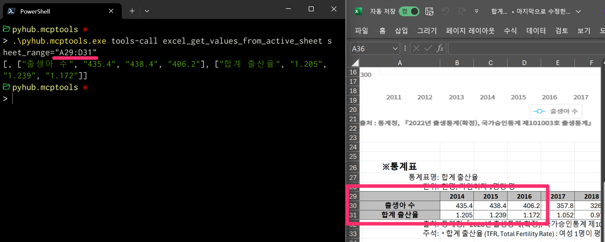

`excel_set_values` 도구를 통해 지정 범위의 값을 변경하실 수도 있습니다.

``` title="위 영상에서는 JSON 포맷으로 입력했지만, 최신 버전에서는 CSV 포맷만 지원"
.\pyhub.mcptools.exe tools-call excel_set_values sheet_range="A34" values='val1,val2,val3\nval4,val5,val6'
```

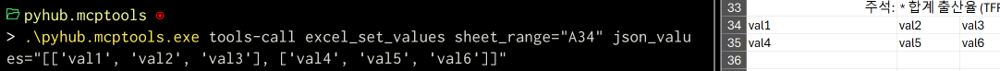

물론 다른 특정 시트를 지정해서 값을 읽어오거나 값을 변경하는 도구도 지원합니다.

!!! note

    우리는 방금 일일이 Tool 이름과 인자를 지정해서 호출했지만, 이제 그럴 필요가 없습니다.

    상상해보세요. Claude/Cursor에게 말만 하면, 알아서 지정한 위치의 데이터를 읽어가고 **AI가 생각한 뒤에** 지정한 위치에 데이터를 기록합니다. 😮

### 5. Claude Desktop에 등록하기

이제 Claude Desktop에 등록해서, AI가 알아서 엑셀 도구 호출을 요청해서 데이터를 읽어가고 값을 변경할 수 있도록 해보겠습니다.
[Claude Desktop 프로그램](https://claude.ai/download)이 아직 설치되어 있지 않으시다면 다운받아서 설치하시고 로그인까지 해주세요.

!!! note

    Claude 무료 계정에서도 MCP를 사용하실 수 있습니다. 단, 유료 계정에 비해서 제한적으로 적은 횟수의 채팅만 지원됩니다.

!!! note

    MCP 도구는 웹 브라우저가 아닌 로컬에 설치된 Claude Desktop을 통해서만 사용하실 수 있습니다.
    다른 MCP 클라이언트 프로그램은 [Example Clients](https://modelcontextprotocol.io/clients) 페이지에서 확인하실 수 있습니다.
    (ex: Claude Code, Copilot-MCP, Cursor, Cline, Continue)

    "파이썬사랑방 MCP 도구" 에서는 Claude Desktop에 대한 자동 설정을 지원합니다. 다른 MCP 클라이언트 프로그램에 대한 자동 설정은 지원하진 않지만,
    직접 설정하셔서 사용하실 수 있습니다.

Claude Desktop 프로그램을 실행하시고, "파일" -> "설정" 창을 띄워주세요.

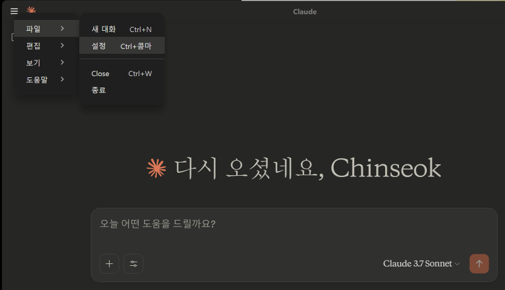

개발자 탭에서 MCP 서버 설정 내역을 확인하실 수 있습니다. 지금은 등록된 MCP 서버가 없어서 목록이 비워진 상황입니다.
"설정 편집" 버튼을 클릭하시면
윈도우 탐색기를 통해 `c:\Users\사용자\AppData\Roaming\Clauide\claude_desktop_config.json` 경로의 파일을 확인하실 수 있습니다.

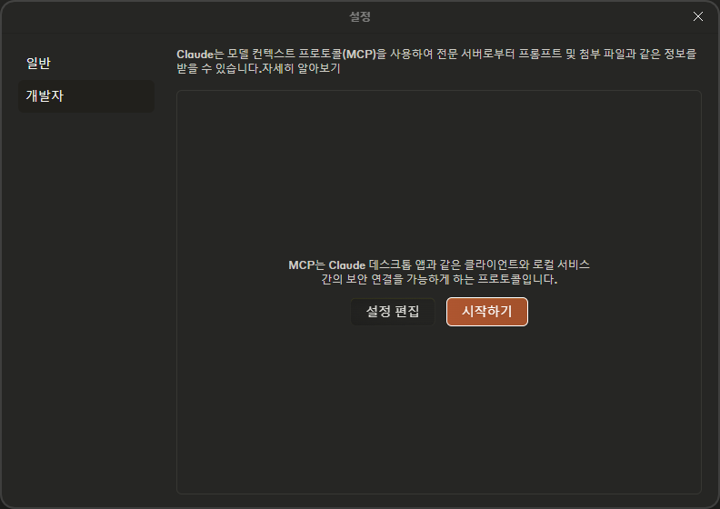

이 파일을 메모장 등의 텍스트 편집기를 통해 여셔서 아래 내용으로 직접 설정을 수정해주셔야 하는 데요.
이 부분에서 실수할 여지가 많습니다. (경로명 오타, JSON 문법 오류, 관련 프로그램 미설치 등)

```json
{
    "mcpServers": {
        "pyhub.mcptools": {
            "command": "C:\\mcptools\\pyhub.mcptools\\pyhub.mcptools.exe",
            "args": [
                "run",
                "stdio"
            ]
        }
    }
}
```

`pyhub.mcptools.exe` 하나에 관련 라이브러리가 모두 포함되어있으니, 관련 프로그램은 모두 설치된 상황이구요.
MCP 설정을 자동으로 추가해주는 명령을 지원합니다.
JSON 파일 편집없이 한 번에 설정을 추가하실 수 있기 때문에 "경로명 오타", "JSON 문법 오류" 등이 발생할 여지가 전혀 없습니다. 😉

일단 `.\pyhub.mcptools.exe setup-print` 명령으로 현재 설정 내역을 출력해보시죠. 아래와 같이 파일이 없다고 출력되거나 `{}` 처럼 빈 설정으로 출력이 되실 거구요.


이제 `.\pyhub.mcptools.exe setup-add` 명령만 실행하시면 한 번에 `pyhub.mcptools` 에 대한 MCP 서버 설정이 자동으로 추가되고,
다시 `.\pyhub.mcptools.exe setup-print` 명령을 실행해보시면 아래와 같이 설정이 적용되었음을 확인하실 수 있습니다.

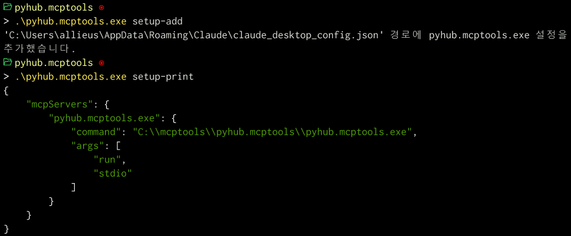

### 6. Claude Desktop 재실행

이제 Claude Desktop 프로그램을 완전히 종료해주시고 재실행해주시면, Claude Desktop에서 MCP 설정을 다시 로딩하고
Claude Desktop 내부에서 MCP 서버를 새롭게 띄웁니다.

그런데 Claude Desktop 프로그램에서 "닫기" 버튼을 클릭하는 것 만으로는 완전히 종료되지 않습니다.
작업 관리자를 여시고 Claude 프로세스에 대해 "작업 끝내기"를 해주셔야만 하는 데요.

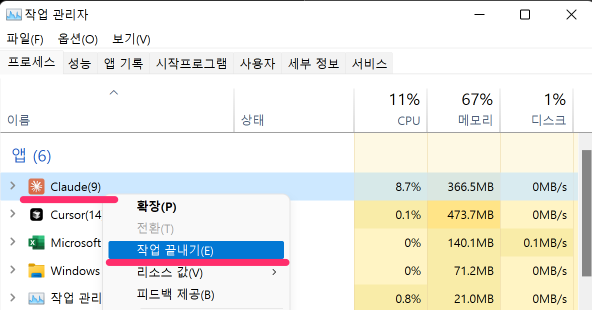

이 과정이 번거로워, One more thing. 또 하나의 명령을 제공합니다.
아래 명령을 실행하시면 한 번에 Claude Desktop 프로세스를 다 종료시키실 수 있습니다.

```
.\pyhub.mcptools.exe kill claude
```

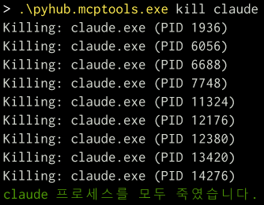

이제 다시 Claude Desktop 애플리케이션을 열어주세요.
등록된 MCP 도구 실행에 시간이 몇 초 정도 걸릴 것이구요.
아래와 같이 등록된 MCP 도구 개수를 확인하실 수 있습니다.


위 스크린샷에서는 도구가 3개이구요. 정상적으로 도구를 인식했습니다. 향후 업데이트가 되면 지원하는 도구 개수가 늘어날 수 있습니다.

망치 아이콘을 클릭하시면 이렇게 "파이썬사랑방 MCP 도구"에서 지원하는 도구 목록을 확인하실 수 있습니다.

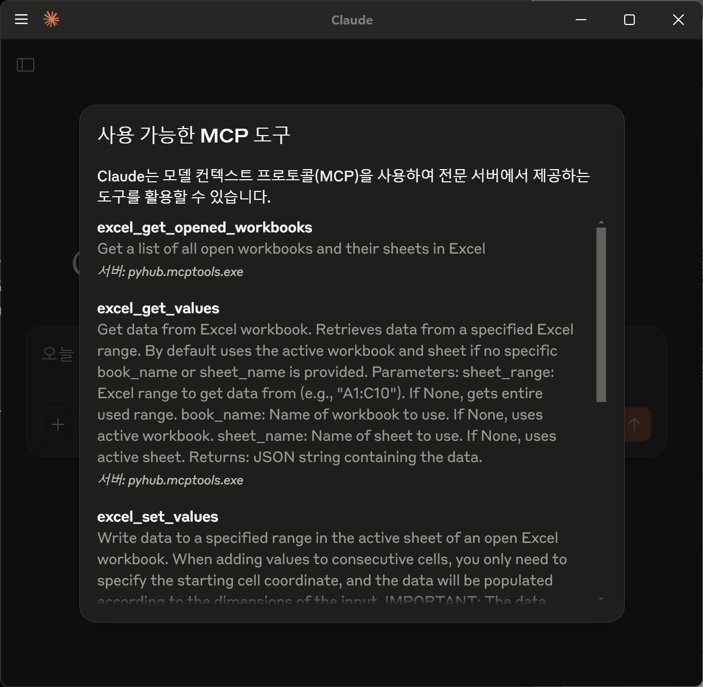

이제 Claude와 대화를 하면, Claude가 엑셀 도구가 필요하다고 판단하는 시점에 알아서 엑셀 도구를 호출합니다.

### 7. Claude를 통해 엑셀 협업하기

[엑셀 도구](../../mcptools/excel/index.md) 페이지를 참고해주세요.

### 8. 최신 버전으로 업데이트하기

`.\pyhub.mcptools.exe --version` 명령을 통해 현재 버전을 확인하실 수 있고,
`.\pyhub.mcptools.exe check-update` 명령을 통해 새버전 유무를 확인하실 수 있습니다.


새 버전이 있으시면 안내의 페이지에서 윈도우 zip 파일을 다운받아시고,
압축을 풀어 `c:\mcptools\pyhub.mcptools\` 폴더에 덮어쓰기 해주시면 되는 데요.

`update` 명령도 지원합니다. 😉

명령을 직접 덮어쓰시기 전, 혹은 `update` 명령을 실행하시기 전에 `.\pyhub.mcptools.exe kill claude` 명령으로 Claude Desktop을 먼저 종료해주세요.
종료하지 않으시면 덮어쓰기 하실 때 해당 실행파일이 사용 중이라서 덮어쓰기할 수 없다라는 오류를 만나시게 됩니다.

```
.\pyhub.mcptools.exe kill claude
.\pyhub.mcptools.exe update
```

Claude Desktop을 다시 실행해주시면 업데이트 끝입니다.

!!! note

    v0.6.6 (2024.04.10) 버전에서는 `update` 명령에서 Claude Desktop, Cursor 종료 여부를 묻는 기능이 추가되었습니다.

## 이슈 해결

### 업데이트 시 "Access is denied" 오류

`pyhub.mcptools.exe update` 명령 실행 시 Claude Desktop이 실행 중이면 `"Access is denied"` 오류가 발생할 수 있습니다. 이는 Windows에서 실행 중인 프로그램 파일을 수정할 수 없기 때문입니다.

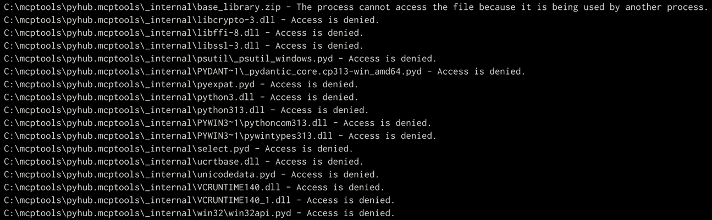

1. Claude Desktop 프로세스를 모두 종료해주세요.
    - 작업관리자를 통해 직접 프로세스 종료시키기
    - 혹은 윈도우를 재부팅
2. 페이지 상단의 PowerShell 설치 스크립트를 다시 실행하여 최신 버전으로 재설치하시면, 업데이트 끝.

!!! note
    Claude Desktop에 이미 MCP 도구가 등록되어 있다면 `setup-add` 명령을 다시 실행할 필요가 없습니다.

### Excel 작업 시 "com.error -2147352530 unknown name" 오류

이 오류는 주로 Excel 파일이 보호된 보기 상태이거나 편집이 제한된 상태일 때 발생합니다.

해결 방법:

1. Excel 프로그램을 완전히 종료
2. Excel 파일을 다시 열어 편집 가능 상태인지 확인
3. 보호된 보기를 해제하고 편집을 활성화
4. 이후 Claude를 통해 작업을 다시 시도
