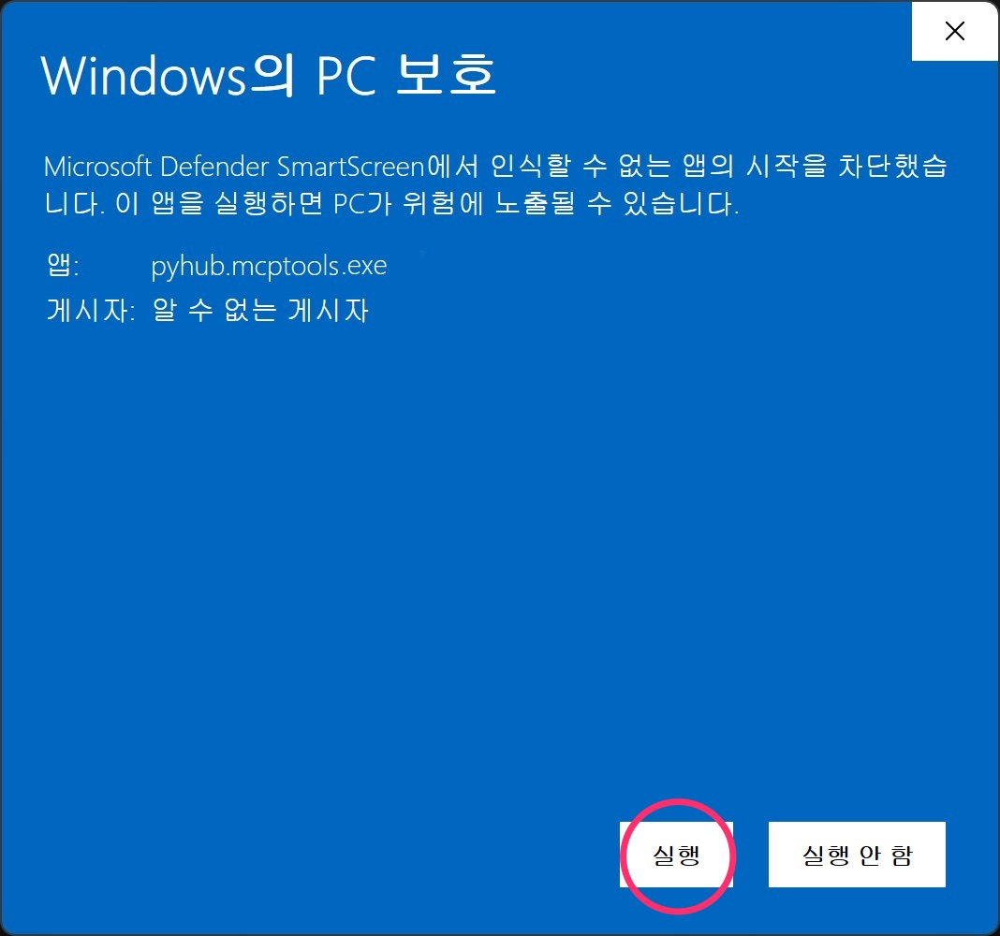
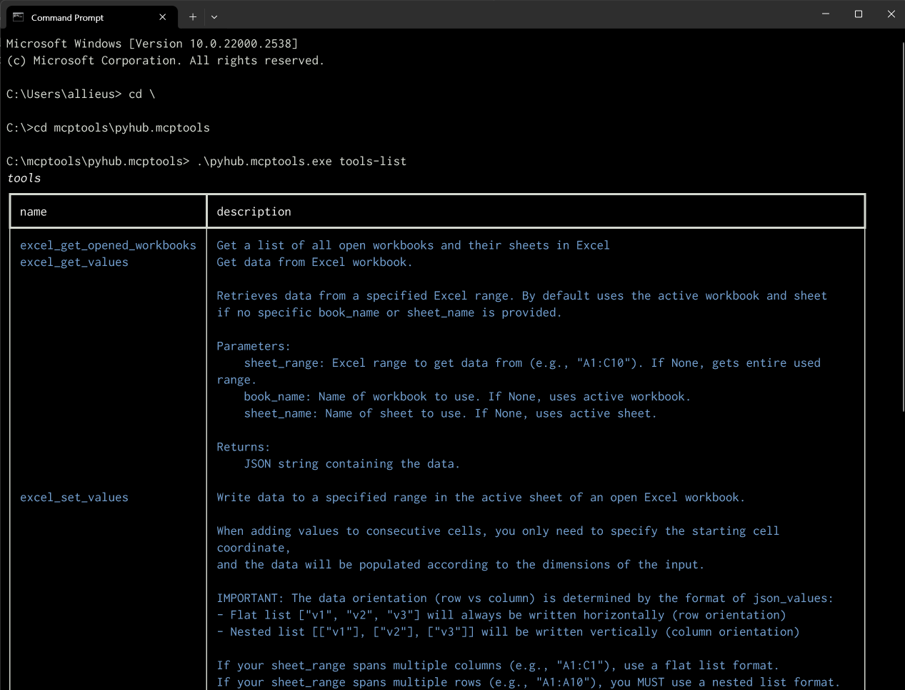
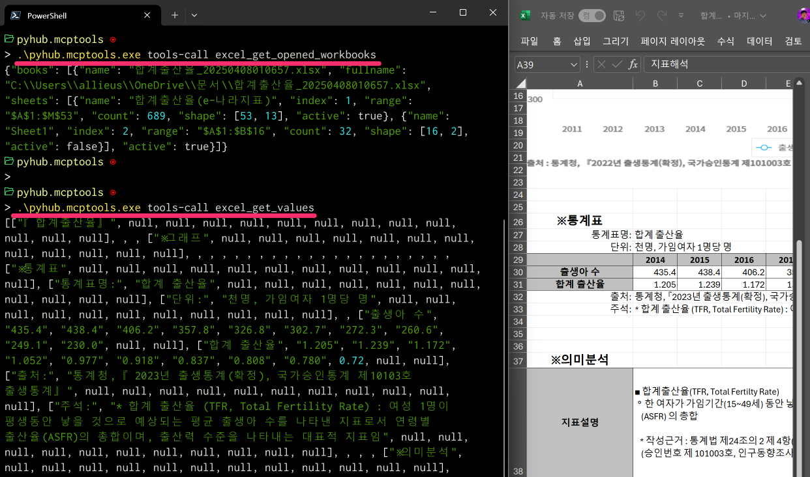
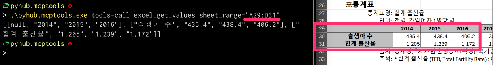

# 윈도우

## 시작하기에 앞서

엑셀 도구 사용을 위해서는 엑셀 2016 이상이 반드시 설치되어 있으셔야 합니다.

## 실행 파일로 빠르게 구성하기

node/파이썬/도커 설치없이도 실행파일 만으로 MCP 서버를 구성하실 수 있습니다.

### 1. 실행파일 받아서 압축 풀기

[공식 릴리즈 페이지](https://github.com/pyhub-kr/pyhub-mcptools/releases)에서 윈도우 용으로 최신 버전을 받아주세요.


원하는 경로에 압축을 풀어주세요. 저는 `c:\mcptools\` 경로에 풀어주겠습니다. 여러분도 같은 경로에 풀어주세요.

!!! note

    설치 마법사는 지원 예정이며, 실행 파일을 직접 복사해주셔야 합니다.

`c:\mcptools\pyhub.mcptools\` 폴더 아래에서 `pyhub.mcptools.exe` 실행 파일이 확인됩니다.


### 2. 실행파일 차단 풀기

윈도우 탐색기에서 `pyhub.mcptools.exe` 파일을 더블클릭해서 실행해주세요.
`pyhub.mcptools.exe` 파일은 아직 서명되지 않아서 아래와 같이 Microsoft Defender SmartScreen에서 실행을 막습니다.

!!! note

    만약 아래의 "Windows의 PC 보호" 창이 뜨지 않고 까만 터미널 창이 떴다가 사라진다면,
    실행파일 차단이 안 된 상황이므로 다음 3단계로 넘어가시면 됩니다.


"추가 정보" 링크를 클릭하시면 아래와 같이 경고 화면이 뜹니다. "실행" 버튼을 클릭하시면, 실행 허용이 됩니다.



그럼 아래의 까만 창이 실행되었다가 빠르게 사라질 것입니다.


### 3. 엑셀 Tool 실행을 확인하기

아직 GUI는 지원하지 않고, 명령행에서 명령을 실행해주셔야 합니다. 명령 프롬프트를 띄워주세요.


명령 프롬프트에서 다음 명령으로 `c:\` 경로로 이동해주시구요.

```
cd \
```

다음 명령으로 `mcptools\pyhub.mcptools\` 경로로 이동합니다. 

```
cd mcptools\pyhub.mcptools\
```

아래 명령으로 지원하는 도구 목록을 확인하실 수 있습니다.

```
.\pyhub.mcptools.exe tools-list
```



!!! note

    `c:\mcptools\` 경로명에서 역슬래시(`\`) 글자와 원화 글자는 폰트에 따라 다르게 보여질 뿐, 같은 글자입니다. 

### 4. MCP 도구를 통해 엑셀 읽어보기 

Claude 에서 AI가 알아서 MCP 도구를 호출할 테지만, 지원하는 엑셀 도구와의 인터페이스를 이해하기 위해 MCP 도구를 직접 실행해봅시다.
"파이썬사랑방 MCP 도구"에서는 MCP 도구 직접 실행을 지원합니다. 간편하게 MCP 도구 동작을 확인하실 수 있습니다. 😉 다른 MCP 도구들은
[MCP Inspector](https://modelcontextprotocol.io/docs/tools/inspector)를 써야만 동작을 확인할 수 있습니다.

먼저 통계청 [합계출산율](https://www.index.go.kr/unity/potal/main/EachDtlPageDetail.do?idx_cd=1428) 엑셀 파일을 받아서 열어주세요.

`pyhub.mcptools.exe`에서는 `tools-call` 명령으로 지정 도구를 호출할 수 있습니다.
`excel_get_opened_workbooks` 도구를 호출하여 현재 엑셀 프로그램을 통해 열려있는 엑셀 파일 내역을 조회해보겠습니다.

```
.\pyhub.mcptools.exe tools-call excel_get_opened_workbooks
```

그리고, 아래 명령으로 현재 활성화된 (앞에 띄워진) 시트의 모든 데이터를 조회할 수 있습니다.

```
.\pyhub.mcptools.exe tools-call excel_get_values_from_active_sheet
```

한글이 `\uc9c0`처럼 보여지는 것은 유니코드 코드값으로 보여지는 것 뿐입니다. 한글이 깨진 것이 아니니 안심하세요.
(최신 버전에서는 패치되어 한글로 정상적으로 보여집니다.)



`excel_get_values_from_active_sheet` 도구 호출 시에 `sheet_range="A29:D31"` 인자를 지정하여
지정 범위의 값 만을 읽어올 수도 있습니다.

```
.\pyhub.mcptools.exe tools-call excel_get_values_from_active_sheet sheet_range="A29:D31"
```



`excel_set_values_to_active_sheet` 도구를 통해 지정 범위의 값을 변경하실 수도 있습니다.

```
.\pyhub.mcptools.exe tools-call excel_set_values_to_active_sheet sheet_range="B35" json_values="[['hello'], ['world']]"
```


물론 다른 특정 시트를 지정해서 값을 읽어오거나 값을 변경하는 도구도 지원합니다.

### 5. Claude Desktop에 등록하기

이제 Claude Desktop에 등록해서, AI가 알아서 엑셀 도구 호출을 요청해서 데이터를 읽어가고 값을 변경할 수 있도록 해보겠습니다.
[Claude Desktop 프로그램](https://claude.ai/download)이 아직 설치되어 있지 않으시다면 다운받아서 설치해주세요.

!!! note

    MCP 도구는 웹 브라우저가 아닌 로컬에 설치된 Claude Desktop을 통해서만 사용하실 수 있습니다.
    다른 MCP 클라이언트 프로그램은 [Example Clients](https://modelcontextprotocol.io/clients) 페이지에서 확인하실 수 있습니다.
    (ex: Claude Code, Copilot-MCP, Cursor, Cline, Continue)

    "파이썬사랑방 MCP 도구" 에서는 Claude Desktop에 대한 자동 설정을 지원합니다. 다른 MCP 클라이언트 프로그램에 대한 자동 설정은 지원하진 않지만,
    직접 설정하셔서 사용하실 수 있습니다.

Claude Desktop 프로그램을 실행하시고, "파일" -> "설정" 창을 띄워주세요.


개발자 탭에서 MCP 서버 설정 내역을 확인하실 수 있습니다. "설정 편집" 버튼을 클릭하시면
윈도우 탐색기를 통해 `c:\Users\사용자\AppData\Roaming\Clauide\claude_desktop_config.json` 경로의 파일을 확인하실 수 있습니다.


이 파일을 메모장 등의 텍스트 편집기를 여셔서 아래 내용으로 직접 설정을 수정해주셔야 하는 데요.
이 부분에서 실수할 여지가 많습니다. (경로명 오타, JSON 문법 오류, 관련 프로그램 미설치 등)

```json
{
    "mcpServers": {
        "pyhub.mcptools.exe": {
            "command": "C:\\mcptools\\pyhub.mcptools\\pyhub.mcptools.exe",
            "args": [
                "run",
                "stdio"
            ]
        }
    }
}
```

본 설치에서는 `pyhub.mcptools.exe` 하나에 관련 라이브러리가 모두 포함되어있으니, 관련 프로그램은 모두 설치된 상황이구요.
아래 명령으로 여러분들이 JSON 파일 편집없이 한 번에 설정을 추가하실 수 있기 때문에 "경로명 오타", "JSON 문법 오류" 등이 발생할 여지가 전혀 없습니다. 😉

일단 `.\pyhub.mcptools.exe setup-print` 명령으로 현재 설정 내역을 출력해보시죠. 아래와 같이 파일이 없다고 출력되거나 `{}` 처럼 빈 설정으로 출력이 되실 거구요.


이제 `.\pyhub.mcptools.exe setup-add` 명령만 실행하시면 한 번에 설정이 자동으로 추가되고, 
다시 `.\pyhub.mcptools.exe setup-print` 명령을 실행해보시면 아래와 같이 설정이 적용되었음을 확인하실 수 있습니다. 


### 6. Claude Desktop 재실행

이제 Claude Desktop 프로그램을 완전히 종료해주시고 재실행해주시면 MCP 설정을 로딩합니다.

그런데 Claude Desktop 프로그램에서 "닫기" 버튼을 클릭하는 것 만으로는 완전히 종료되지 않습니다.
작업 관리자를 여시고 Claude 프로세스에 대해 "작업 끝내기"를 해주셔야만 하는 데요.


이 과정이 번거로워, One more thing. 또 하나의 명령을 제공합니다.
아래 명령을 실행하시면 한 번에 Claude Desktop 프로세스를 다 종료시키실 수 있습니다.

```
.\pyhub.mcptools.exe kill claude
```


이제 다시 Claude Desktop 애플리케이션을 열어주세요.
등록된 MCP 도구 실행에 시간이 몇 초 정도 걸릴 것이구요.
아래와 같이 등록된 MCP 도구 개수를 확인하실 수 있습니다.


망치 아이콘을 등록하시면 이렇게 "파이썬사랑방 MCP 도구"에서 지원하는 도구 목록을 확인하실 수 있습니다.
(최신 버전에서는 도구 성능을 위해 도구 설명을 영어로 변경했습니다.)


### 7. Claude를 통해 엑셀 협업하기

[엑셀 도구](../../mcptools/excel/index.md) 페이지를 참고해주세요.

### 8. 환경변수 PATH에 등록하기

`c:\mcptools\pyhub.mcptools\pyhub.mcptools.exe` 명령을 다른 경로에서도 손쉽게 실행할 수 있도록
환경변수 PATH에 `c:\mcptools\pyhub.mcptools\` 경로를 추가해주세요.
윈도우 환경변수 설정 기능을 활용하셔도 되고, 명령행에서 아래 명령으로 추가하실 수도 있습니다.

``` title="명령 프롬프트"
set PATH=%PATH%;c:\mcptools\pyhub.mcptools\
setx PATH "%PATH%"
```

``` title="파워쉘"
$env:PATH += ";c:\mcptools\pyhub.mcptools\"
[Environment]::SetEnvironmentVariable("PATH", $env:PATH, [EnvironmentVariableTarget]::User)
```

이제 어떤 경로에서든 `pyhub.mcptools.exe` 명령을 사용하실 수 있습니다.

### 9. 최신 버전으로 업데이트하기

`.\pyhub.mcptools.exe --version` 명령을 통해 현재 버전을 확인하실 수 있고,
`.\pyhub.mcptools.exe check-update` 명령을 통해 새버전 유무를 확인하실 수 있습니다. 


새 버전이 있으시면 안내의 페이지로 이동하셔서 윈도우 zip 파일을 다운받아주시구요.
압축을 풀어 `c:\mcptools\pyhub.mcptools\` 폴더에 덮어쓰기 해주시면 되는 데요.

덮어쓰기 하시기 전에 `.\pyhub.mcptools.exe kill claude` 명령으로 Claude Desktop을 먼저 종료해주세요.
종료하지 않으시면 덮어쓰기 하실 때 해당 실행파일이 사용 중이라서 덮어쓰기할 수 없다라는 오류를 만나시게 됩니다.

!!! warning

    압축을 푸시고 덮어쓰기 하시기 전에 `c:\mcptools\pyhub.mcptools\` 폴더 내의 `_internal` 폴더를 반드시 먼저 삭제해주세요.
    삭제하지 않으시면 앞선 버전의 메타 파일들이 남아있게 됩니다.

`c:\mcptools\pyhub.mcptools\` 폴더에 압축을 풀어 덮어쓰기 하시고, Claude Desktop을 다시 실행해주시면 업데이트 끝입니다.

## 소스 코드로 직접 구성하기

!!! note

    TODO